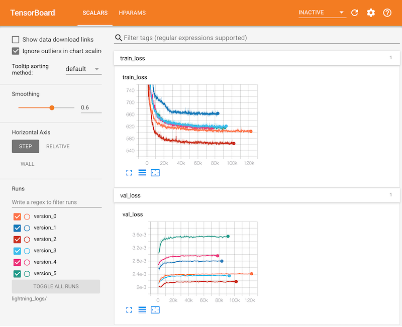

# DCASE2020 Challenge Task 2 baseline
This is a repository to replicate a baseline system for **DCASE 2020 Challenge Task 2 "Unsupervised Detection of Anomalous Sounds for Machine Condition Monitoring"** - [link](http://dcase.community/challenge2020/task-unsupervised-detection-of-anomalous-sounds). This repository is based on the [original repository](https://github.com/daisukelab/dcase2020_task2_variants) and modified to be suitable for the scale of the AML course. 

## 1. Description

Baseline system implements VAE with Pytorch, and provides reproducible training & testing codes on google Colab.

## 2. Using examples

1. Prepare `dev_data` folder as described in the [original baseline USAGE](https://github.com/y-kawagu/dcase2020_task2_baseline#usage).

    ./dcase2020_task2_variants (this folder)
        /dev_data              (prepare this)

2. Train and test models. Run a notebook named `00-train-test-all.ipynb`.


### 2.1 Sample result


`result.csv`
```
ToyCar
id		AUC		pAUC
01		0.791331		0.665015
02		0.843655		0.766151
03		0.615191		0.540928
04		0.851536		0.700667
Average		0.775428		0.668190

```

### 2.2 Training curve visualization example

Thanks to PyTorch Lightning and tensorboard, we could visualize training curve. Here's an example.



## 3. Links

- [Original baseline repository - https://github.com/y-kawagu/dcase2020_task2_baseline](https://github.com/y-kawagu/dcase2020_task2_baseline)
